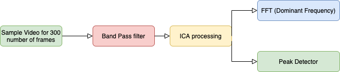

# VideoBiometricsIOS
## Heart rate monitoring using facial color changes

This project is a proof of concept IOS application demonstrating how a persons heart rate can be monitored from minute color changes in face that result as blood flowing to tha face due heart activity

## Prequisites

* Xcode version 11.4. (This project uses both SwiftUI and the Swift programming language)
* OpenCV 4.0 or greater. (This project uses OpenCV for image processing. Instructions for installing openCV for mac can be found at https://docs.opencv.org/master/d0/db2/tutorial_macos_install.html. Install both opencv and opencv_contrib
* IOS 13.4 or later

## Operation

This application uses openCV to detect the users face, then a rectangular area of the forehead is tracked for 5-10 seconds. At the end of this period the RGB components are filtered. Independent Component Analysis, (ICA), is applied to the filtered data. The ICA components are then processed both by peak detection and FFT to determine if a heart rate can be detected. The diagram below illustrates the sequence.

## Tuning Parameters
* Pause between Samples. (Boolean)  Useful for pausing the video if FFT/Peak detection data is to be examined
* Frame Rate (Toggle) 30 FPS or 60 FPS
* Frames per Heart Rate same (Numeric) Number of frames analysis sample
* Band Pass filter. (Floating point) Low/High cutoff frequencies in Hz

## Build notes
After cloning this repositary, do the following
* Download and build the opencv framework for IOS
* Open the VideoBiometrics solution with XCode
* Drag opencv2.framework from the IOS build location to top level in XCode project navigator. (That is, opencv2.framework should be at the same level "Products" and "Frameworks" in the XCode navigator window)
